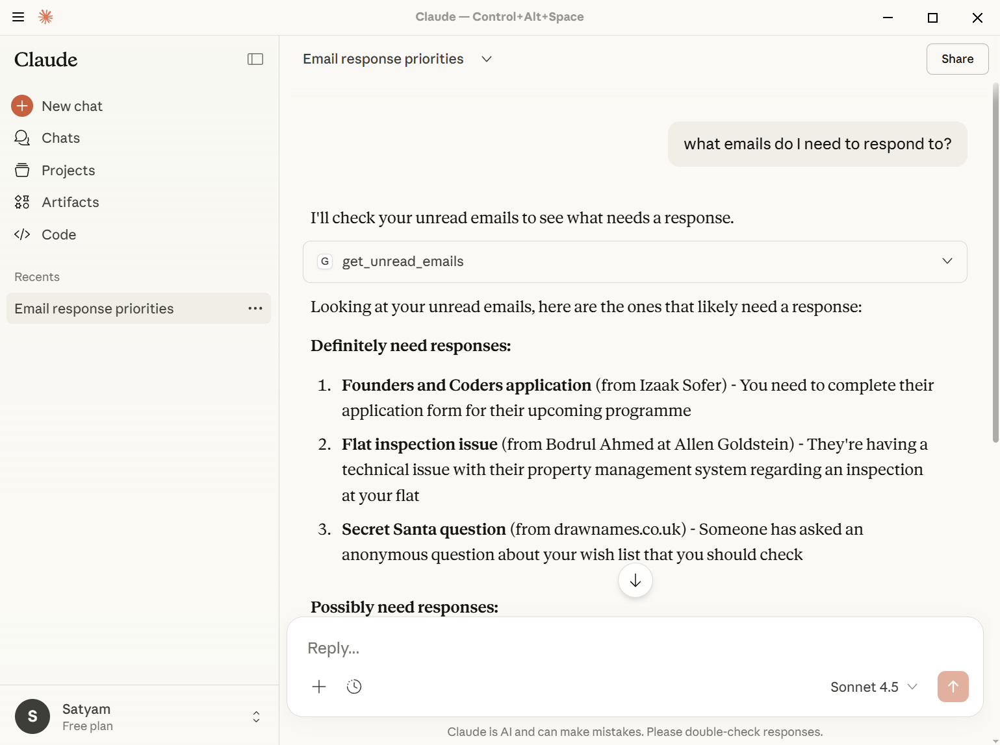
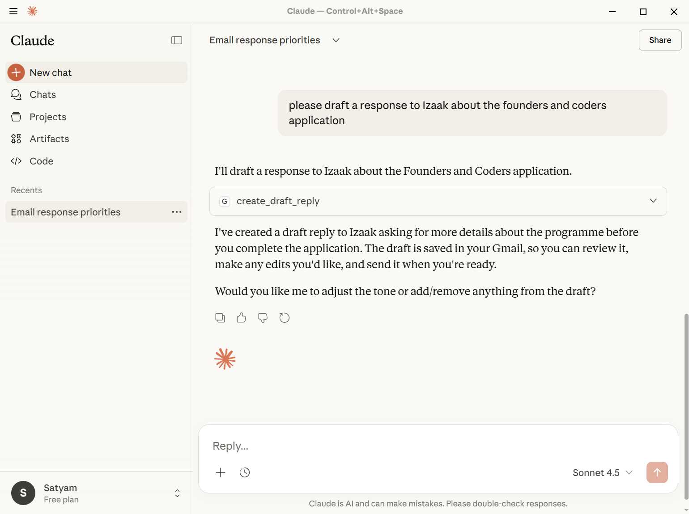
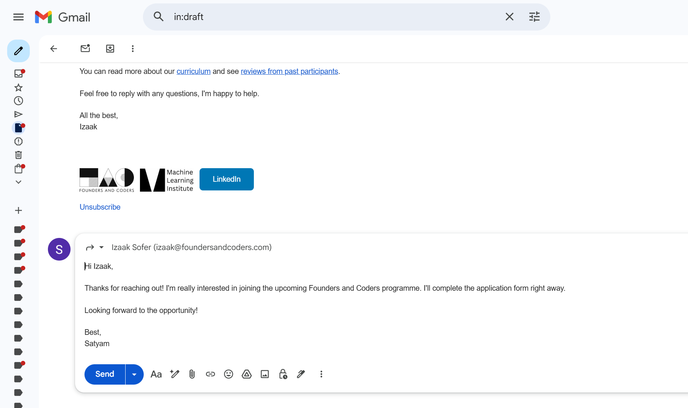

# Gmail MCP Assistant

A Model Context Protocol (MCP) server that enables Anthropic's Claude to read unread emails and create draft responses using the Gmail API.

## Prerequisites

- Python 3.10+
- uv (Python package manager)
- Claude Desktop app installed
- A Google Cloud Project with the Gmail API enabled

## Setup

### 1. Google Cloud Configuration

1. Go to the [Google Cloud Console](https://console.cloud.google.com/) and create a new project
2. Enable the Gmail API
3. Configure the OAuth Consent Screen and add your email as a Test User
4. Create OAuth 2.0 Credentials for a Desktop Application
5. Download the JSON file, rename it to `client_secret.json`, and place it in this project's root directory

### 2. Installation

```bash
# Install dependencies
uv sync
```

### 3. Authentication

On first run, Claude Desktop will start the server and open a browser window for OAuth authentication. After authorizing, a `token.json` file will be created for future use.

### 4. Claude Desktop Configuration

Add this server to your Claude Desktop MCP configuration file. Edit `claude_desktop_config.json` and add:

```json
{
  "mcpServers": {
    "gmail-assistant": {
      "command": "C:\\Users\\Satyam\\.local\\bin\\uv.exe", 
      "args": [
        "--directory",
        "C:\\Users\\Satyam\\Downloads\\mlx_application",
        "run",
        "server.py"
      ]
    }
  }
}
```

Update the paths to match your system:
- `command`: Path to your `uv.exe` executable (you can get this by running `uv where`)
- `--directory`: Path to this project directory

After saving the configuration, restart Claude Desktop to load the server.

## Usage

Once configured, you can use the tools in Claude Desktop. Simply start a chat and ask something like 'What emails do I need to respond to?'. Claude will use the following tools:

- `get_unread_emails`: Retrieve unread emails from your inbox
- `create_draft_reply`: Create a draft reply for a specific email thread

### Examples

#### Getting Unread Emails



#### Creating a Draft Reply



#### Draft Reply in Gmail


